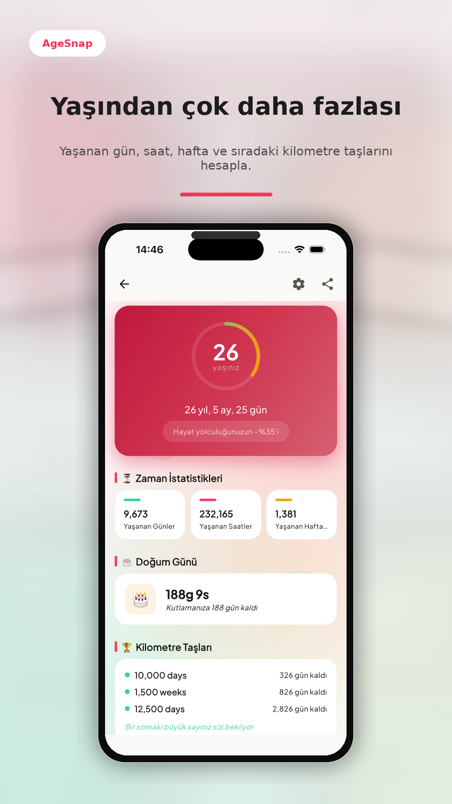
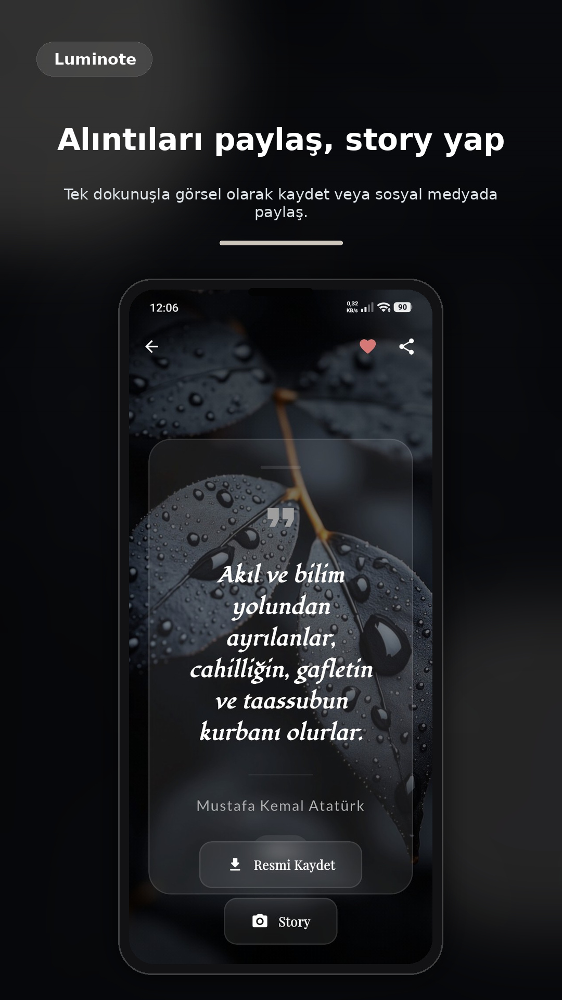
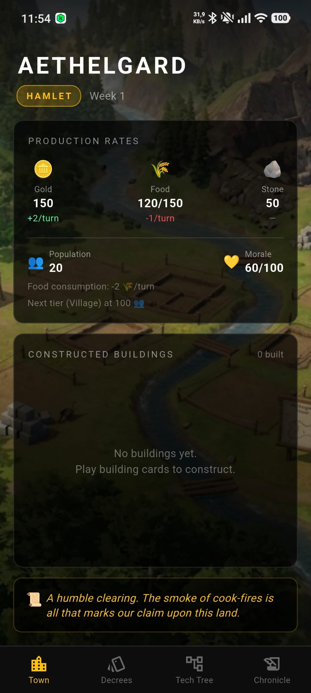
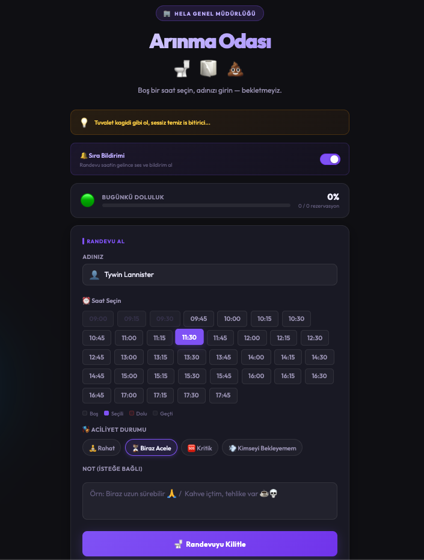

# Metehan Der
### Flutter Mobil Uygulama Geliştirici · Software Team Lead

Wireframe'den mağaza yayınına, tek bir ürün ekosistemi mantığıyla uçtan uca mobil geliştirme.

🇹🇷 **Türkçe** &nbsp;|&nbsp; [🇬🇧 English](README_EN.md)

---

### 👋 Merhaba

Çeliker Teknoloji'de Software Team Lead olarak mobil ekibe liderlik ediyor, wireframe'den mağaza yayınına kadar uçtan uca ürün geliştiriyorum. IoT tabanlı uygulamalar (Bluetooth/Wi-Fi haberleşme, offline çalışma) ve admin/bayi panelleri konusunda derinleşmiş durumdayım. Kişisel zamanımda oyun tasarımı ve deprem takip gibi kendi problemlerimi çözen ürünler geliştiriyorum.

- 🔭 Şu an: **Moto Signal** ekosistemi (mobil + admin panel + web) üzerinde çalışıyorum
- 🎓 Necmettin Erbakan Üniversitesi — Bilgisayar Mühendisliği (Eylül 2026 mezuniyet)
- 📱 Play Store'da 1 yayında, 2 kapalı test, 3 geliştirme aşamasında kişisel uygulama

---

### 🛠️ Aktif Kullandığım Teknolojiler

Diğer araçlar ve diller

 

---

### 💼 Çeliker Teknoloji'de Geliştirdiğim Ürünler

**Moto Signal** — Motosiklet kullanıcılarına yönelik mobil uygulama; admin panel ve tanıtım sitesiyle birlikte tek ekosistem olarak, UI tasarımından yayına kadar uçtan uca geliştirdim.

**Akıllı Fırın (IoT)** — Bluetooth/Wi-Fi üzerinden cihazla haberleşen, internet olmadan da çalışabilen bir kontrol uygulaması; bağlantı yönetimi ve cihaz durumu takibi en zorlu kısımdı.

**Ozon Hava Temizleyici Ekosistemi** — Mobil uygulama, Node.js backend/API ve masaüstü bayi panelini aynı veri akışı üzerinde birbirine bağladım.

**IoT Perde Kontrol Sistemi** — Cihaz bağlantısı ve login akışlarını kapsayan mobil modül.

---

### 🎮 Kişisel Projelerim

Her birinde wireframe'den yayına kadar tüm süreç (UI/UX, geliştirme, Firebase/Analytics/AdMob entegrasyonu) bana ait.

**🧩 Puzzle Oyunu** — Play Store'da yayında.
 `Flutter` `Dart` `Firebase` `AdMob`

**🌍 QuakeHub** — Canlı harita işaretleyicileri, deprem eğitim içeriği ve yakınlarım/güvenlik modülü sunan deprem takip uygulaması. *(Geliştiriliyor)*
 `Flutter` `Supabase` `Realtime` `Dart`

**🏰 Aethelgard** — Kriz mekanikleri ve kaynak yönetimi sistemleri barındıran, kart tabanlı & sıra tabanlı karanlık ortaçağ yerleşim kurma oyunu. *(Geliştiriliyor)*
 `Flutter` `Custom Painter` `Dart`

**🧱 Shape Breaker** — Güç artırıcılar, boss mekanikleri ve nadirlik seviyeli kart tasarımlarına sahip tuğla kırma oyunu. *(Kapalı test)*
 `Flutter` `Custom Painter` `Firebase`

**📝 LumiNote** — Özlü söz paylaşımı ve kişisel not tutma özellikleri sunan uygulama. *(Kapalı test)*
 `Flutter` `Firebase` `Hive`

**🎂 AgeSnap** — Doğum bilgisine göre yaşanılan gün sayısı, fal yorumu ve ortalama yaşam süresi gibi kişiselleştirilmiş bilgiler sunan, takvim entegrasyonlu uygulama. *(Geliştiriliyor)*
 `Flutter` `Firebase` `Takvim Entegrasyonu`

**📚 Leala** — Kişisel kullanım için geliştirilen İngilizce kelime ezberleme uygulaması.
 `Flutter` `Hive` `Local Storage`

**🚻 Arınma Odası** — *"Bekletmeyiz, sıkıştırmayız."* Ofis tuvalet kuyruğunu 15 dakikalık slotlarla rezervasyona bağlayan, kurumsal esprili bir iç kaynak yönetim aracı: tarayıcı bildirimi, sesli anons, doluluk barı ve aciliyet durumu seçici içeriyor.
 `Node.js` `Express`

**🧘 Ergonomik Asistan** — Ofis çalışanları için göz dinlendirme, duruş kontrolü, su içme, esneme ve yürüyüş molası gibi özelleştirilebilir hatırlatmalar sunan; sessiz saatler, otomatik başlatma ve sistem tepsisi entegrasyonuna sahip masaüstü uygulaması. *(Windows & macOS)*
 `Flutter Desktop` `Native Notifications`

---

&nbsp;&nbsp;&nbsp;

   

&nbsp;&nbsp;&nbsp;

---

### 🎓 Eğitim & Akademik Projeler

**Bilgisayar Mühendisliği (Lisans)** — Necmettin Erbakan Üniversitesi *(Eylül 2026)*
- Prof. Dr. Mehmet Hacıbeyoğlu danışmanlığında KNN/Karar Ağacı/SVM karşılaştırmalı kalp hastalığı sınıflandırma projesi
- Flutter + TensorFlow ile köpek ırkı tespiti yapan mobil uygulama (2020-2021)
- iFixit'in basit bir mobil klonu

**Sertifikalar:** Java, Mock-Up Figma/Mobile App Design, Kullanıcı Deneyimi ve Kullanılabilirlik (TÜBİTAK BİLGEM YTE, 2023) · Yazılım Test Mühendisliği (Kuveyt Türk, 2020)

---

**Diller:** Türkçe (Ana Dil) · İngilizce (B1)

### 📊 GitHub'da Neler Oluyor

  

<picture>
  <source media="(prefers-color-scheme: dark)" srcset="https://raw.githubusercontent.com/metehan-der/metehan-der/output/github-contribution-grid-snake-dark.svg">
  <source media="(prefers-color-scheme: light)" srcset="https://raw.githubusercontent.com/metehan-der/metehan-der/output/github-contribution-grid-snake.svg">
  
</picture>

---

📧 tr.metehander@gmail.com · 🌐 <a href="https://metehan-der.github.io/website/">metehan-der.github.io</a> · 💼 <a href="https://tr.linkedin.com/in/metehander">linkedin.com/in/metehander</a>

